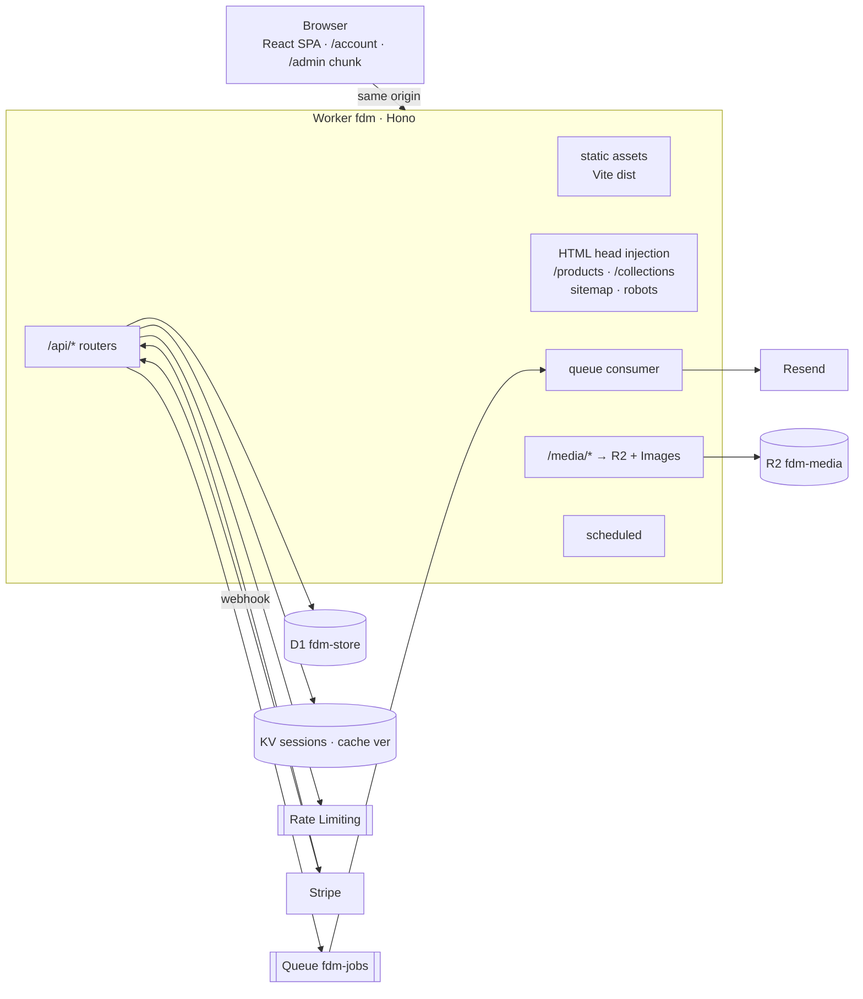

# FDM Commerce — Step 0: repo scan, architecture, schema, plan

Status: **built.** This document is the design; the code follows it, with the
changes noted here:

- **Payments** — cash on delivery only, behind the provider interface. No
  Stripe (see decision 2), so the webhook path exists and is tested with a
  stand-in gateway but ships with no webhook provider enabled.
- **Config** — `wrangler.jsonc`, not `wrangler.toml`: Cloudflare's own guidance
  is that newer config features are JSON-only, and the repo already used JSONC.
- **Edge caching** — Workers Cache with `Cache-Tag` purging, rather than the KV
  cache-version scheme sketched below. Same effect, fewer moving parts.
- **Phases** — delivered as one piece rather than six checkpoints, at your
  request.

Scanned at `7678853` (main), 2026-09-15.

---

## 1. What is in the repo today

| Area | Finding |
|---|---|
| Framework | React 19.3 + Vite 8, **plain JavaScript/JSX**, no TypeScript. `@remotion/player` renders the hero film live; Lenis drives smooth scroll. |
| Routing | **None.** One page. Sections are hash anchors (`src/data/sections.js`). Product page, catalogue, bag, checkout and mobile menu are full-screen overlays toggled by `useState` in `App.jsx` (`quick`, `catalogue`, `checkout`, `menu`), with a single `locked` flag for scroll. No URL exists for a product or collection, so nothing is deep-linkable or indexable. |
| Components | `src/components/`, one file per section. Commerce: `Shop` (home grid, first 10), `Catalogue` (full-screen search, category chips, sort), `ProductCard`, `ProductPage` (variant picker, related), `CartDrawer`, `Checkout` (single-step form), `Newsletter`. Content: `Hero` + `remotion/`, `Marquee`, `Feed`, `Editorial`, `Lookbook`, `PopUps`, `Nav`, `MobileMenu`, `Footer`, `Preloader`, `Cursor`, `Reveal`. |
| State | `src/store/cart.jsx`: React Context + `useReducer`, persisted to `localStorage` (`fdm.bag.v1`). Lines are keyed `productId::size::colour` and snapshot name, **price** and image on the client. No variant id on the line. No server-state library; everything else is local component state. |
| Design system | `src/styles.css` (1,422 lines). Tokens `--ink --bone --sand --terra --chili --sage --ash`, Instrument Serif + Inter, `.display .d-xl…d-sm`, `.label`, `.btn`, `.chip`, `.plate.packshot`, `.co-*` form/sheet styles, drawer and overlay patterns. No CSS framework or component library. |
| API client | `src/lib/api.js`: `post()` with a 12 s timeout; treats a non-JSON reply as "offline" so the GitHub Pages copy falls back to `mailto:`. |
| Backend | `worker/index.js`: plain-JS Worker, no framework. `POST /api/order`, `POST /api/subscribe`, `GET /api/orders` (Bearer `ADMIN_KEY`), `/api/health`. Prices come from generated `worker/catalogue.js` (cents). |
| Data | D1 `fdm-store` (`ecba53f7…`): `orders` (items as a JSON blob), `subscribers`. **0 orders, 0 subscribers**, so there is nothing to migrate. |
| Infra | `wrangler.jsonc`, one environment, live at `fdm.follies.workers.dev`. **R2 is not enabled** on the account. No KV namespaces. A GitHub Pages copy is still published by `npm run deploy`. |

### Every place that uses static or mock data

| Source | What it holds | Read by | Becomes |
|---|---|---|---|
| `src/data/products.js` → `PRODUCTS` | 54 products generated from the live Shopify store's `products.json`. Float USD prices, Shopify variant ids, an `available` snapshot, images hotlinked from `cdn.shopify.com` | `Shop`, `Catalogue`, `ProductPage` (related + variant availability), `ProductCard` (sold-out badge), `data/assets.js` | D1 catalog → `GET /api/products`, `/api/products/:handle`, `/availability` |
| `products.js` → `CATEGORIES` | Hand-written chip list that groups Shopify collections (Jewellery = Necklaces + Earrings + Bracelets) | `Shop`, `Catalogue` | `collections` (a smart collection covers Jewellery) |
| `products.js` → `DROP` | "Échappée 4 à 7" | `Shop`, `Lookbook` headings | Title of the featured collection |
| `products.js` → `POPUPS` | Three pop-up events | `PopUps` | Stays static (editorial, not commerce). Can become a settings block later |
| `data/assets.js` → `LOOKS`, `EDITO` | Product handles picked by hand | `Lookbook`, `Editorial` | Manual collections `lookbook` and `editorial` |
| `data/assets.js` → `CRITICAL` | Images held behind the preloader | `Preloader` | Built from the home payload |
| `data/assets.js` → `FEED`, `HERO_FRAME`, `SHEET`, `PAPER`, `FINALE` | Instagram frames in `public/media/ig` | `HeroFilm`, `Feed`, `MobileMenu` | Stays static (brand content) |
| `worker/catalogue.js` → `PRICES` | Generated id → cents map | Worker | Deleted; prices live on `variants` |
| `store/cart.jsx` | Client-side lines with price | `Nav`, `MobileMenu`, `CartDrawer`, `Checkout` | Server cart, same context API |
| `Checkout.jsx` → `PAYMENTS`, `FIELDS`, `HOUSE` | Whish/COD hard-coded, a Lebanese address form, a mailto fallback | `Checkout` | Providers and shipping rates from the API; the mailto path is removed |
| `ProductPage.jsx` → `DOT`, exchange copy, "View on folliesdapresmidi.com" | Colour-name → hex map, policy text, Shopify link | PDP | `product_option_values.swatch_hex`, policy page, link removed at cutover |
| `Footer.jsx` → `COLS`, email, exchange-policy link | Hard-coded categories (all → `#boutique`), contact, external Shopify page | Footer | Collections, store settings, `pages` |
| `store/cart.jsx` → `money()` | `` `$${n}` `` on whole dollars | Everywhere | `Intl.NumberFormat` over minor units and the store currency |
| `scripts/pull-catalogue.mjs`, `gen-prices.mjs` | Shopify sync and price generation | npm scripts | Replaced by a one-time Shopify → D1 + R2 import |

---

## 2. Decisions that change the plan (please confirm)

1. **Is this replacing Shopify?** The plan assumes yes. Import the 54 real products, options, variants, collections and images into D1 and R2 once (that import doubles as the "realistic" seed). Shopify keeps running until the domain cuts over in Phase 6.
2. **Stripe cannot onboard a business based in Lebanon.** It needs a legal entity in a Stripe-supported country. Proposal: build the provider layer and Stripe as specified, but launch with **Cash on Delivery + Whish (manual)**, which the current checkout already offers. Stripe switches on once keys exist. A real Whish API integration later is one new provider file.
3. **Stock for COD and manual Whish.** There is no webhook, so "decrement on payment confirmation" would let COD orders oversell. Proposal: each provider declares `commit: 'webhook' | 'on_placement'`. COD and manual Whish commit stock atomically when the order is placed; cancelling restocks. Stripe commits in the webhook as specified.
4. **KV is the wrong store for rate limits and carts.** KV is eventually consistent (up to ~60 s) and allows about 1 write/s per key, so counters undercount, rapid quantity taps get lost, and the abandoned-cart cron cannot query KV. Proposal:
   - **Carts** live in D1; the guest cart id sits in a signed cookie.
   - **Rate limits** use the Workers Rate Limiting binding (per-location counters, 10 s or 60 s windows).
   - **KV** holds sessions, the catalog cache version and settings cache.
   - **Admin revocation** is exact: a D1 `session_epoch` is checked on every admin request.
5. **SEO without SSR-ing the SPA.** Full React SSR of this app (Remotion player, Lenis, `window` everywhere) is effectively a rebuild. Proposal: for `/products/:handle` and `/collections/:handle`, the Worker streams `index.html` through `HTMLRewriter` and injects:
   - title, description, canonical, Open Graph/Twitter tags and JSON-LD (`Product`, `Offer`, `BreadcrumbList`)
   - the initial data
   - an HTML snapshot of the same visible content, which React replaces on mount
   Crawlers and shoppers see the same content.
6. **Password hashing.** Workers WebCrypto caps PBKDF2 at 100,000 iterations. Proposal: PBKDF2-SHA256 at 100k iterations, a 16-byte salt and an HMAC pepper held as a secret, stored in a versioned format (`pbkdf2-sha256$100000$…`) so hashes can be upgraded on next login. Pure-JS scrypt is the alternative, at ~50–100 ms of CPU per login.
7. **Workers Paid plan ($5/month).** Free allows 10 ms of CPU per request, which rules out password hashing, CSV import and webhook work.
8. **Config file.** `wrangler.toml` as specified. (Cloudflare now defaults new projects to `wrangler.jsonc`; say if you'd rather keep JSONC. Both support environments.)
9. **Frontend language and libraries.** The Worker and `shared/` are TypeScript strict. Existing JSX components are edited only to wire data, with no mass conversion. All *new* frontend code (API client, account, checkout steps, admin) is TSX. Add **React Router** (URLs drive the existing overlays, so the back button closes them) and **TanStack Query** (server state).
10. **Retire the GitHub Pages copy.** It cannot run carts, auth or checkout.
11. **Checkout holds for limited drops (recommended).** Starting payment reserves stock for 15 minutes. Reservations reduce *available* stock but never decrement `on_hand`; the decrement still happens only on confirmation. This avoids "paid, then refunded because it sold out" during a drop.

---

## 3. Architecture



### Layout

```
wrangler.toml            dev (top level) · [env.staging] · [env.production]
drizzle.config.ts
migrations/              drizzle-kit SQL + hand-written FTS5/triggers, applied by wrangler d1 migrations
shared/                  Zod schemas + DTO types, imported by worker and web
worker/
  index.ts               fetch / queue / scheduled entry
  app.ts                 Hono app; middleware order: requestId → secureHeaders → errors → session → csrf → rateLimit → rbac
  env.ts                 Bindings type
  routes/                store · cart · checkout · auth · account · admin/* · webhooks · seo · media
  domain/                pure, framework-free: pricing · discounts · tax · shipping · inventory · order-state
  payments/              provider.ts (interface) · registry.ts · stripe.ts · cod.ts · whish-manual.ts
  db/                    schema/*.ts · client.ts · queries/
  jobs/                  queue handlers · cron handlers
  email/                 resend.ts · templates/
  lib/                   crypto · money · errors · cache · csv · slug · ids
src/                     existing storefront, plus router.jsx, lib/api.ts (Hono RPC client),
                         account/*, checkout steps, admin/* (lazy-loaded)
scripts/                 import-shopify.ts · seed.ts · create-owner.ts
test/                    unit/ · integration/ (Vitest + @cloudflare/vitest-pool-workers)
```

### Environments and bindings

| Binding | dev (`wrangler dev`) | staging (`fdm-staging`) | production (`fdm`) |
|---|---|---|---|
| `DB` D1 | local | `fdm-staging` | `fdm-store` (existing) |
| `KV` | local | `fdm-kv-staging` | `fdm-kv` |
| `MEDIA` R2 | local | `fdm-media-staging` | `fdm-media` |
| `IMAGES` | Images binding | ✓ | ✓ |
| `JOBS` Queue + DLQ | local | `fdm-jobs-staging` | `fdm-jobs` |
| `RL_AUTH`, `RL_CHECKOUT`, `RL_API` | ratelimit | ✓ | ✓ |
| Cron | — | ✓ | ✓ |
| Secrets | `.dev.vars` | `STRIPE_SECRET_KEY` `STRIPE_WEBHOOK_SECRET` `RESEND_API_KEY` `PASSWORD_PEPPER` `COOKIE_SECRET` | same |

### Core design

**Money.** Every amount is `INTEGER` minor units named `*_amount`. Rates are basis points (`rate_bps`, 11% = 1100). A single `priceCart()` pure function produces the full breakdown (lines, discounts, shipping, tax, total) and is the only source of totals, for the cart preview, checkout and order creation alike. Discounts are allocated across lines by largest remainder, so line totals always sum exactly. That matters for refunds and per-line tax.

**Atomic inventory on D1.** D1 has no interactive transactions, but `db.batch([...])` is atomic. `variants.inventory_on_hand` carries `CHECK (inventory_on_hand >= 0 OR inventory_policy = 'continue')`. The commit batch contains, in order:
- decrement every line
- insert the order and its lines
- insert `inventory_adjustments`
- insert `order_events`
- increment discount usage, guarded by a similar CHECK
- mark the checkout completed

If any line would go negative, the constraint throws and the whole batch rolls back. There is no read-then-write race. On a Stripe webhook, that failure becomes: order `cancelled` with reason `oversold`, automatic `refund()`, an event, and an email.

**Idempotent webhooks.** Verify the signature (`constructEventAsync` with SubtleCrypto). `webhook_events(provider, event_id)` is the primary key, and the insert runs **in the same batch** as the effects, so a replay hits the key and does nothing. `orders.checkout_id` is `UNIQUE`, which gives a second guard. The webhook returns quickly; emails go to the queue.

**Payment provider interface.**
```ts
interface PaymentProvider {
  id: string;                                  // 'stripe' | 'cod' | 'whish_manual' | …
  commit: 'webhook' | 'on_placement';
  createCheckout(i: CheckoutInput): Promise<
    | { kind: 'redirect'; url: string; ref: string }
    | { kind: 'placed'; ref: string; instructions?: string }>;
  handleWebhook(req: Request, env: Env): Promise<PaymentEvent[]>;   // verified + normalised
  refund(i: { ref: string; amount: number; currency: string; reason?: string }): Promise<RefundResult>;
}
```
Business logic consumes only the normalized `PaymentEvent` (`payment.succeeded | payment.failed | refund.succeeded`, with `checkoutId`, `amount`, `eventId`). A local gateway later means one file plus a registry entry. Stripe starts as hosted Checkout (lowest PCI scope, brand colours applied); Embedded Checkout is a drop-in later.

**Order state.** `status`: `pending → paid → fulfilled → shipped → delivered`, terminal `cancelled` and `refunded`, exactly your list. A separate `payment_status` (`unpaid | paid | partially_refunded | refunded`) handles partial refunds and COD, where cash arrives after delivery. All changes go through `transitionOrder()`, which checks an allowed-transitions table and writes the `order_events` row in the same batch. A trigger makes `order_events` append-only (`RAISE(ABORT)` on UPDATE/DELETE).

**Auth and sessions.**
- **Accounts:** customers and staff live in separate tables with separate cookies (`__Host-fdm_s` Lax, `__Host-fdm_admin` Strict), so no customer flow can reach a staff record.
- **Sessions:** a random 32-byte token goes in the cookie; KV stores it under `sess:<sha256(token)>` with a TTL (30 days sliding for customers, 12 hours for staff).
- **Revocation:** logout, password change and role change bump `session_epoch`.
- **Tokens:** email verification, password reset and staff invites are single-use, hashed and expiring rows in `auth_tokens`.

**CSRF.** SameSite cookies, Hono's `csrf()` Origin check, and a per-session token sent as `x-csrf-token` on every non-GET request. Webhooks are exempt (signature instead).

**Rate limits.**
- **Login:** 5/min per IP and per email.
- **Register and reset:** 3/min per IP, plus a D1 check capping resets at 3 per 15 minutes.
- **Checkout:** 10/min per IP.
- **Everything else:** a general API ceiling.

Cloudflare Turnstile on register and reset is optional.

**Validation and errors.** Zod on every body, query and param (`@hono/zod-validator`). One error shape:
```json
{ "error": { "code": "VALIDATION_FAILED", "message": "…", "fields": { "email": "Invalid email" }, "requestId": "01J…" } }
```

**Catalog caching.** Public GETs go through the Cache API, keyed by URL plus `catalog_version` from KV. Any product, collection or settings write bumps the version, so every PoP misses on its next read. This works on any plan and needs no purge-by-tag. **Stock is never cached:** `/api/products/:handle/availability` is `no-store`, so a cached product page can never promise a size that just sold.

**Images.** Originals are stored in R2 at `products/<productId>/<ulid>.<ext>`. `/media/<key>?w=` transforms them through the Images binding to AVIF or WebP, with widths limited to 320/640/960/1400/2000 to bound unique transformations. Results are cached at the edge. Admin bulk upload streams multipart through the Worker into R2.

**Search.** An FTS5 table `products_fts(title, description, tags, options, skus)` with tokenizer `unicode61 remove_diacritics 2`, so "etagere" finds "Étagère". It is rebuilt in the same batch as each product save and ranked with `bm25`, with prefix matching for as-you-type. It joins with filters (collection, price, size, colour, availability) using cursor pagination. Note: `wrangler d1 export` skips virtual tables, so backups rely on D1 Time Travel plus a rebuildable index.

**Jobs.**
- **Queue `fdm-jobs`:** a typed union of `email.send`, `order.placed` side effects, `collection.rematerialize`, `csv.import` and `search.reindex`, with a DLQ.
- **Cron `*/5`:** expire checkout holds and stale Stripe sessions.
- **Cron hourly:** abandoned carts (email captured, idle 1–24 h, not converted, not yet reminded).
- **Cron daily:** clean up expired tokens, dead carts, and webhook events older than 90 days.

---

## 4. Database schema (D1 / Drizzle)

Conventions: `id TEXT` ULIDs; `*_at INTEGER` unix ms; `*_amount INTEGER` minor units; booleans are `INTEGER 0/1`; `*_json TEXT CHECK(json_valid(…))`; foreign keys on.

### Store
| Table | Columns (key constraints) |
|---|---|
| `store_settings` | `id=1` singleton · name · currency (ISO 4217) · prices_include_tax · logo_media_id · contact_email · contact_phone · address_json · timezone · weight_unit · updated_at |
| `pages` | id · handle UNIQUE · kind (`policy`/`page`) · title · body_html (sanitized) · published · seo_title · seo_description · updated_at |
| `media` | id · r2_key UNIQUE · mime · bytes · width · height · alt · created_by · created_at |

### Catalog
| Table | Columns |
|---|---|
| `products` | id · handle UNIQUE · title · description_html · status CHECK(`draft`/`active`/`archived`) · product_type · vendor · seo_title · seo_description · published_at · created_at · updated_at · INDEX(status, published_at) |
| `product_options` | id · product_id FK cascade · name · position · UNIQUE(product_id, position) |
| `product_option_values` | id · option_id FK cascade · value · position · swatch_hex NULL |
| `variants` | id · product_id FK cascade · sku UNIQUE NULL · option1/2/3 · price_amount CHECK ≥0 · compare_at_amount NULL CHECK > price · cost_amount NULL · weight_grams · requires_shipping · taxable · inventory_tracked · inventory_policy (`deny`/`continue`) · **inventory_on_hand CHECK(≥0 OR policy='continue')** · media_id NULL · position · UNIQUE(product_id, option1, option2, option3) |
| `product_media` | product_id · media_id · position · PK(product_id, media_id) |
| `tags` / `product_tags` | id · name UNIQUE NOCASE / PK(product_id, tag_id) |
| `collections` | id · handle UNIQUE · title · description_html · type (`manual`/`smart`) · rules_json (`{match: all\|any, rules:[{field: tag\|price\|type\|vendor\|title\|in_stock, op, value}]}`) · sort (`manual`/`price_asc`/`price_desc`/`created_desc`/`title_asc`/`best_selling`) · image_media_id · published · seo_* · timestamps |
| `collection_products` | collection_id · product_id · position · PK(collection_id, product_id). Smart collections are materialized here on save via the queue, so listings stay a plain indexed join |
| `inventory_reservations` | id · variant_id · checkout_id · quantity · expires_at · INDEX(variant_id, expires_at) |
| `inventory_adjustments` | id · variant_id · delta · reason (`order`/`cancel_restock`/`refund_restock`/`manual`/`import`) · order_id NULL · staff_id NULL · note · created_at |
| `products_fts` | FTS5 virtual table (hand-written migration) |

### Customers and staff
| Table | Columns |
|---|---|
| `customers` | id · email UNIQUE NOCASE · password_hash NULL (guests) · first_name · last_name · phone · email_verified_at · accepts_marketing · session_epoch · note · orders_count · total_spent_amount (denormalized in the order batch → LTV) · timestamps |
| `customer_addresses` | id · customer_id FK cascade · first_name · last_name · line1 · line2 · city · region · country_code · postal_code NULL · phone · notes · is_default |
| `staff_users` | id · email UNIQUE NOCASE · password_hash · name · role CHECK(`owner`/`admin`/`staff`) · permissions_json (staff only: `products:write`, `orders:refund`, …) · status (`invited`/`active`/`disabled`) · session_epoch · last_login_at · timestamps |
| `auth_tokens` | id · subject_type · subject_id · purpose (`verify_email`/`reset_password`/`staff_invite`) · token_hash UNIQUE · expires_at · used_at |
| `wishlist_items` | id · customer_id FK cascade · product_id FK cascade · created_at · UNIQUE(customer_id, product_id) |
| `subscribers` | email PK · customer_id NULL · source · status · unsubscribe_token_hash · created_at |

### Cart and checkout
| Table | Columns |
|---|---|
| `carts` | id · customer_id NULL · email NULL · discount_code NULL · status (`active`/`merged`/`converted`) · converted_order_id · reminder_sent_at · timestamps · INDEX(status, updated_at) |
| `cart_lines` | id · cart_id FK cascade · variant_id FK · quantity CHECK 1–99 · UNIQUE(cart_id, variant_id). **No price column**: always repriced |
| `checkouts` | id · cart_id · customer_id NULL · email · phone · shipping_address_json · shipping_rate_id · discount_code · pricing_json (snapshot at payment start) · subtotal/discount/shipping/tax/total_amount · currency · provider · provider_ref · status (`open`/`payment_pending`/`completed`/`expired`/`failed`) · expires_at · order_id NULL |

### Orders
| Table | Columns |
|---|---|
| `order_counters` | id=1 · next_number (human order numbers, #1001…) |
| `orders` | id · number UNIQUE · **checkout_id UNIQUE** · customer_id NULL · email · phone · status CHECK(pending, paid, fulfilled, shipped, delivered, cancelled, refunded) · payment_status · provider · currency · subtotal/discount/shipping/tax/total/refunded_amount · prices_include_tax · shipping_address_json · shipping_method_title · discount_codes_json · customer_note · cancel_reason · cancelled_at · placed_at · updated_at · INDEX(status, placed_at), (customer_id, placed_at), (email) |
| `order_lines` | id · order_id FK cascade · product_id NULL · variant_id NULL · title · variant_title · sku · quantity · unit_price_amount · discount_amount · tax_amount · total_amount · fulfilled_quantity · refunded_quantity |
| `order_tax_lines` | id · order_id · order_line_id NULL (NULL = shipping) · name · rate_bps · amount |
| `order_events` | id · order_id · type · from_status · to_status · actor_type (`system`/`customer`/`staff`/`webhook`) · actor_id · data_json · created_at. **Append-only trigger.** Internal notes are `type='note'` |
| `payments` | id · order_id NULL · checkout_id · provider · kind (`sale`/`refund`) · status · amount · currency · provider_ref · error_code · created_at |
| `refunds` | id · order_id · amount · reason · restock · lines_json · provider_ref · status · staff_id · created_at |
| `fulfillments` / `fulfillment_lines` | id · order_id · status · carrier · tracking_number · tracking_url · shipped_at · delivered_at / fulfillment_id · order_line_id · quantity |
| `webhook_events` | provider · event_id · type · received_at · PK(provider, event_id) |

### Discounts, shipping, tax, ops
| Table | Columns |
|---|---|
| `discounts` | id · code UNIQUE NOCASE · type (`percentage`/`fixed_amount`/`free_shipping`/`buy_x_get_y`) · value (bps or minor units) · applies_to (`all`/`products`/`collections`) · min_subtotal_amount · min_quantity · usage_limit · usage_limit_per_customer · **usage_count CHECK(usage_limit IS NULL OR usage_count ≤ usage_limit)** · bxgy_json (`{buyQty, getQty, getPercentOffBps, maxPerOrder}`) · starts_at · ends_at · status |
| `discount_targets` | discount_id · target_type (`product`/`collection`) · target_id · role (`applies`/`buy`/`get`) |
| `discount_redemptions` | id · discount_id · order_id · customer_id NULL · email · amount · UNIQUE(discount_id, order_id) |
| `shipping_zones` / `shipping_zone_regions` | id · name / zone_id · country_code · region_code NULL · UNIQUE(country_code, region_code) |
| `shipping_rates` | id · zone_id · name · type (`flat`/`weight`/`price`) · amount · min_value · max_value · delivery_estimate · active · position |
| `tax_rates` | id · country_code · region_code NULL · name · rate_bps · applies_to_shipping · active · UNIQUE(country_code, region_code, name) |
| `audit_log` | id · staff_id · action · entity_type · entity_id · diff_json · ip · created_at |
| `csv_imports` | id · staff_id · r2_key · status · summary_json · errors_json · created_at · finished_at |

---

## 5. API surface

```
Storefront (public; cached unless marked)
GET  /api/store                         settings, enabled payment methods, policy index
GET  /api/products                      ?collection&q&tag&size&colour&min&max&in_stock&sort&cursor&limit
GET  /api/products/:handle
GET  /api/products/:handle/availability no-store
GET  /api/collections[/:handle]
GET  /api/search/suggest?q
GET  /api/pages/:handle
POST /api/subscribe

Cart / checkout
GET    /api/cart            POST /api/cart/lines      PATCH|DELETE /api/cart/lines/:id
POST   /api/cart/discount   DELETE /api/cart/discount
POST   /api/checkout                    cart → checkout (+ holds)
PATCH  /api/checkout/:id                contact, address, shipping rate → priced breakdown
GET    /api/checkout/:id/shipping-rates
POST   /api/checkout/:id/pay            { provider } → redirect | placed
GET    /api/orders/confirmation/:token

Auth / account
POST /api/auth/{register,login,logout,verify-email,forgot-password,reset-password}   GET /api/auth/session
GET|PATCH /api/account   GET /api/account/orders[/:number]   CRUD /api/account/addresses   GET|POST|DELETE /api/account/wishlist

Webhooks      POST /api/webhooks/:provider
Admin (RBAC)  /api/admin/{auth,dashboard,products,variants,media,collections,orders,customers,discounts,shipping,taxes,settings,pages,staff,imports,exports}
SEO / media   /products/:handle  /collections/:handle  /sitemap.xml  /robots.txt  /media/*
```

---

## 6. Wiring the existing UI (no redesign)

| Component | Change |
|---|---|
| `App.jsx` | Overlay state is derived from the URL (`/products/:handle` opens `ProductPage` over home, `/collections/:handle` opens `Catalogue`, `/cart` opens the drawer). Same visuals; back button now closes overlays |
| `store/cart.jsx` | Same context shape (`lines`, `count`, `subtotal`, `add`, `qty`, `remove`, `toast`), backed by the server cart with optimistic updates. `add()` resolves the variant id |
| `Shop`, `Catalogue` | Products and chips from the API. Size/colour/price/in-stock filters use the existing `.chip` row. "See all" and load-more use the existing `.more` pattern |
| `ProductCard` | Compare-at price (one small strikethrough rule in `styles.css`), live sold-out |
| `ProductPage` | Product by handle; option picks resolve a variant; live stock; swatches from option values; related from the collection; exchange copy from the policy page; "Save" wishlist link in `.label link-u` |
| `CartDrawer` | Server subtotal and stock warnings; otherwise unchanged |
| `Checkout` | Same `.co` sheet, now in steps: contact & address (existing fields) → shipping method → payment (existing `.co-pay` radios, providers from the API). The summary gains discount code, shipping and tax lines. Confirmation reuses `.co-done` at `/orders/confirmation/:token` |
| `Lookbook`, `Editorial`, `Preloader`, `Footer` | Collections, settings and pages from the API |
| `Nav`, `MobileMenu` | One "Account" link in the existing label style |
| New: account | Full-screen sheet in the `.co`/`.pdp` pattern: login, register, verify, reset, orders, order detail, addresses, wishlist |
| New: `/admin` | Lazy chunk, same tokens and type (bone paper, ink, `.label`, `.chip`, `.btn`); tables and forms built from existing tokens |

---

## 7. Phases

Every phase ends with: files changed, `npm test` output, local and deploy commands, and the manual-config list. I stop for your go-ahead after each one.

| # | Scope | Done when |
|---|---|---|
| **1** | TS strict + Hono skeleton, error format, middleware (headers, CSRF, rate limits, Zod), `wrangler.toml` with 3 environments; staging and production resources created; Drizzle schema for **all** tables + migration 0001 + FTS5 migration (old empty tables dropped); customer and staff auth (register, login, verify, reset, sessions, hashing); `create-owner` script; Resend + queue consumer; router + typed API client + account sheet (auth screens); Vitest pool-workers harness; pipeline (see below). The current `/api/order` and `/api/subscribe` keep working | `wrangler dev` runs; migrations apply locally and on staging; register → verify email → login works on staging; tests green |
| **2** | Shopify import → D1 + R2 (the 54 real products); seed script (plus synthetic dev customers); catalog, collection and search endpoints with filters, sort, cursors, availability; `/media` pipeline; wire `Shop`, `Catalogue`, `ProductCard`, `ProductPage`, `Lookbook`, `Editorial`, `Footer`, `Preloader`; deep links; delete `products.js`, `catalogue.js` and the generators | Every product visible from D1; search "etagere" finds Étagère; stock updates live |
| **3** | Server cart + guest cookie + merge on login; `priceCart` with discount, shipping and tax engines (seeded rules; admin UIs come in 5); checkout steps + holds; provider layer, Stripe, COD, Whish manual; signed idempotent webhooks; atomic commit; order numbers + `order_events`; confirmation page; account orders, addresses, wishlist; emails (confirmation, abandoned cart via cron) | Integration tests: happy path, oversell race, replayed webhook, bad signature, tampered price all pass |
| **4** | `/admin` shell, staff login, RBAC; dashboard (revenue, orders, AOV, top products, date range); products CRUD + variants + inventory + bulk R2 upload + CSV import/export; collections (manual and smart); orders (filter, detail, transitions, fulfil with tracking → shipping email, refunds, notes); customers (list, detail, LTV); cache-version bump on writes | An owner can run the store end-to-end without touching SQL |
| **5** | Admin: discounts (4 types, limits, dates), shipping zones and rates, taxes (+ inclusive/exclusive), store settings, policy pages, staff invites, roles, permissions, audit log | Every rule in the pricing engine is editable in admin and covered by tests |
| **6** | Head injection + JSON-LD, sitemap, robots, canonicals, OG; cache and image tuning; CSP; full test pass + coverage gate; `/security-review`; backup/restore runbook (Time Travel); production deploy guide; domain cutover from Shopify; retire GitHub Pages | Lighthouse/Rich Results checks pass; production deployed on your domain |

**Deployment pipeline.** GitHub Actions is blocked today (the CLI token lacks the `workflow` scope; see README). Default: **Cloudflare Workers Builds**, connected to the repo; branch `staging` deploys staging and `main` deploys production. The build runs `npm test`, then `wrangler d1 migrations apply --remote --env <env>`, then `wrangler deploy --env <env>`. If you run `gh auth refresh -s workflow`, I can use a GitHub Actions workflow instead, with PR test gating.

---

## 8. Manual setup (yours)

- [ ] Enable **R2** in the Cloudflare dashboard (needs a payment method; free tier applies)
- [ ] Upgrade to **Workers Paid**
- [ ] Choose the storefront domain and add it to Cloudflare (for cutover from Shopify in Phase 6; a `staging.` subdomain earlier)
- [ ] **Resend**: account + domain verification DNS (SPF, DKIM, DMARC). Mail cannot be sent from `@gmail.com`
- [ ] **Stripe** (if you have an eligible entity): API keys; webhook `https://<domain>/api/webhooks/stripe` for `checkout.session.completed`, `checkout.session.async_payment_succeeded`, `checkout.session.async_payment_failed`, `checkout.session.expired`, `charge.refunded`
- [ ] Secrets per environment (Phase 1 hands you the exact `wrangler secret put` list)
- [ ] Connect the repo in Workers Builds, **or** grant the `workflow` scope
